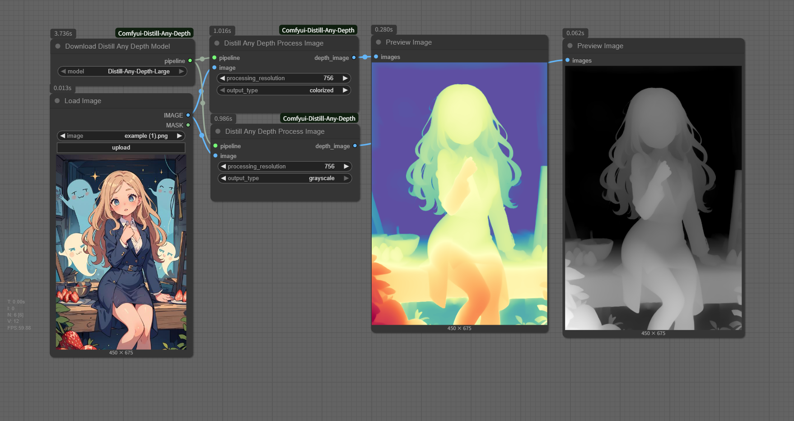

# Comfyui-Distill-Any-Depth

ComfyUI nodes to use Distill-Any-Depth prediction.

Original repo: https://github.com/Westlake-AGI-Lab/Distill-Any-Depth

Huggingface demo: https://huggingface.co/spaces/xingyang1/Distill-Any-Depth

## How to Use

1. Clone this repo to `ComfyUI/custom_nodes` 
2. Install requirements: `pip install -r requirements.txt`

## Model Support

- [x] [Large model](https://huggingface.co/xingyang1/Distill-Any-Depth/tree/main/large)
- [ ] [Small model](https://huggingface.co/xingyang1/Distill-Any-Depth/tree/main/small)
- [ ] [Base model](https://huggingface.co/xingyang1/Distill-Any-Depth/tree/main/base)
- [ ] [Teacher-Large model](https://huggingface.co/xingyang1/Distill-Any-Depth/tree/main/Distill-Any-Depth-Dav2-Teacher-Large-2w-iter)

## Acknowledgements

This ComfyUI node implementation is based on the excellent work from [Distill-Any-Depth](https://github.com/Westlake-AGI-Lab/Distill-Any-Depth). We are grateful to the authors for their outstanding research and for making their code publicly available.
