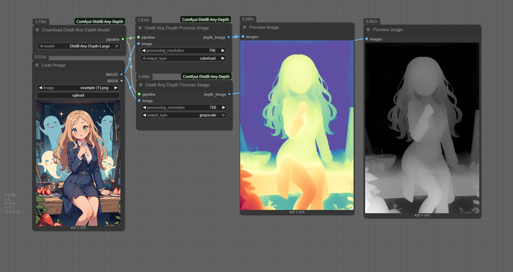

# Comfyui-Distill-Any-Depth

what is this repo🤔? ask: [![zread](https://img.shields.io/badge/Ask_Zread-_.svg?style=plastic&color=00b0aa&labelColor=000000&logo=data%3Aimage%2Fsvg%2Bxml%3Bbase64%2CPHN2ZyB3aWR0aD0iMTYiIGhlaWdodD0iMTYiIHZpZXdCb3g9IjAgMCAxNiAxNiIgZmlsbD0ibm9uZSIgeG1sbnM9Imh0dHA6Ly93d3cudzMub3JnLzIwMDAvc3ZnIj4KPHBhdGggZD0iTTQuOTYxNTYgMS42MDAxSDIuMjQxNTZDMS44ODgxIDEuNjAwMSAxLjYwMTU2IDEuODg2NjQgMS42MDE1NiAyLjI0MDFWNC45NjAxQzEuNjAxNTYgNS4zMTM1NiAxLjg4ODEgNS42MDAxIDIuMjQxNTYgNS42MDAxSDQuOTYxNTZDNS4zMTUwMiA1LjYwMDEgNS42MDE1NiA1LjMxMzU2IDUuNjAxNTYgNC45NjAxVjIuMjQwMUM1LjYwMTU2IDEuODg2NjQgNS4zMTUwMiAxLjYwMDEgNC45NjE1NiAxLjYwMDFaIiBmaWxsPSIjZmZmIi8%2BCjxwYXRoIGQ9Ik00Ljk2MTU2IDEwLjM5OTlIMi4yNDE1NkMxLjg4ODEgMTAuMzk5OSAxLjYwMTU2IDEwLjY4NjQgMS42MDE1NiAxMS4wMzk5VjEzLjc1OTlDMS42MDE1NiAxNC4xMTM0IDEuODg4MSAxNC4zOTk5IDIuMjQxNTYgMTQuMzk5OUg0Ljk2MTU2QzUuMzE1MDIgMTQuMzk5OSA1LjYwMTU2IDE0LjExMzQgNS42MDE1NiAxMy43NTk5VjExLjAzOTlDNS42MDE1NiAxMC42ODY0IDUuMzE1MDIgMTAuMzk5OSA0Ljk2MTU2IDEwLjM5OTlaIiBmaWxsPSIjZmZmIi8%2BCjxwYXRoIGQ9Ik0xMy43NTg0IDEuNjAwMUgxMS4wMzg0QzEwLjY4NSAxLjYwMDEgMTAuMzk4NCAxLjg4NjY0IDEwLjM5ODQgMi4yNDAxVjQuOTYwMUMxMC4zOTg0IDUuMzEzNTYgMTAuNjg1IDUuNjAwMSAxMS4wMzg0IDUuNjAwMUgxMy43NTg0QzE0LjExMTkgNS42MDAxIDE0LjM5ODQgNS4zMTM1NiAxNC4zOTg0IDQuOTYwMVYyLjI0MDFDMTQuMzk4NCAxLjg4NjY0IDE0LjExMTkgMS42MDAxIDEzLjc1ODQgMS42MDAxWiIgZmlsbD0iI2ZmZiIvPgo8cGF0aCBkPSJNNCAxMkwxMiA0TDQgMTJaIiBmaWxsPSIjZmZmIi8%2BCjxwYXRoIGQ9Ik00IDEyTDEyIDQiIHN0cm9rZT0iI2ZmZiIgc3Ryb2tlLXdpZHRoPSIxLjUiIHN0cm9rZS1saW5lY2FwPSJyb3VuZCIvPgo8L3N2Zz4K&logoColor=ffffff)](https://zread.ai/zade23/Comfyui-Distill-Any-Depth) 

---
[ComfyUI](https://github.com/comfyanonymous/ComfyUI) nodes to use [Distill-Any-Depth](https://distill-any-depth-official.github.io/) prediction.

Original repo: https://github.com/Westlake-AGI-Lab/Distill-Any-Depth

Huggingface demo: https://huggingface.co/spaces/xingyang1/Distill-Any-Depth

## Updates

- [2025-07-18] 🌟🌟🌟 Support `small`, `base`, `teacher-large` model.
- [2025-07-14] Support `Large` model.

## How to Use

This video demonstrates how to download and use nodes in ComfyUI.

https://github.com/user-attachments/assets/13ae515c-af85-4d2d-8b3c-6c62e3f79a86

### ComfyUI-Manager

1. Run ComfyUI
2. `Manager` → `Custom Nodes Manager`
3. search and install `Comfyui-Distill-Any-Depth`
4. Run the Distill-any-thing node and enjoy it.
> Typically, the inference model will be automatically downloaded to the `/models/distill_any_depth` directory on the first run.

### Git Clone

1. Clone this repo to `ComfyUI/custom_nodes` 
2. Install requirements: `pip install -r requirements.txt`

## Model Support

- [x] [Large model](https://huggingface.co/xingyang1/Distill-Any-Depth/tree/main/large)
- [x] [Small model](https://huggingface.co/xingyang1/Distill-Any-Depth/tree/main/small)
- [x] [Base model](https://huggingface.co/xingyang1/Distill-Any-Depth/tree/main/base)
- [x] [Teacher-Large model](https://huggingface.co/xingyang1/Distill-Any-Depth/tree/main/Distill-Any-Depth-Dav2-Teacher-Large-2w-iter)

## Acknowledgements

This ComfyUI node implementation is based on the excellent work from [Distill-Any-Depth](https://github.com/Westlake-AGI-Lab/Distill-Any-Depth). 

We are grateful to the authors for their outstanding research and for making their code publicly available.
